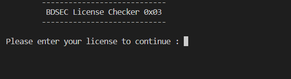
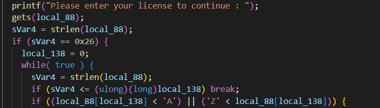
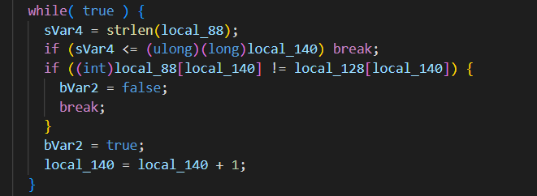
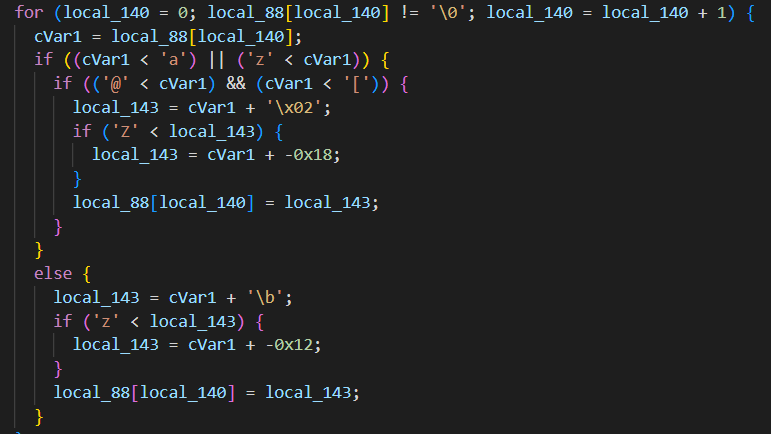
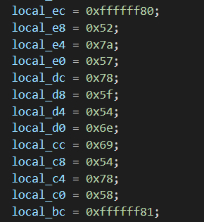
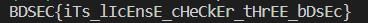
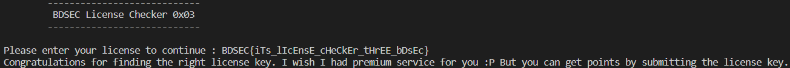

>***Find the flag from the following.***

Once again, we are given a .OUT file in this problem. We need to analyze it's source code to figure out the flag.

We open the .OUT file with [Ghidra](https://ghidra-sre.org/). The decompiler shows us the main function in the source code:

We try to recreate the source code using that. We put the raw source code in **"raw_source.cpp"** file. We can see that we can build and run the file and then it asks to enter the license to continue.  

Let's analyze the code to figure out the license.

In the main() function we can see that the program takes an input string and pass it through a number of loops. If we print the string after each loop, we can see the string is first encoded using the Caesar cipher with offset 13, then reversed and then encoded again using the Caesar cipher but this time the uppercase letters are encoded with offset 2 and lowercase letters are encoded with offset 8. In the main() function we can see that a lot of local variables are declared and assigned to different values. Also we can see that the license strings length should be 38.

Then our input string is compared with the local variables.  

So, we can come to this conclusion that if we reverse the loops and pass the local variables through it, we might get something we can work with. We do this in **"flag_decoder.py"** file. But there are some issues in the source code. The authors of this problem made some logical mistakes while coding for Caesar cipher. The code they wrote for wrapping around while rotating the alphabet is not correct.

For example, if we pass 'x' throgh this loop, it should be encoded as 'f' with ASCII value of 102. But it takes the value of -128 which doesn't have any valid representation in the ASCII table. The way they are adding before checking the overflow is causing the problem. Instead of fixing it, they changed the value in the variables so that it works even with this negative values.

They have assigned negative values to the variables for such corner cases. This makes life harder for us who trying to reverse the whole procedure. So, after some trial and error we see that **0x66** and **0x67** should have been the values used if the source code didn't have logical mistakes. So we work with those values in **"flag_decoder.py"** instead of the negative values. After running the file, we get the following output:

Now this output seems like the flag. We can check it by putting it as input in the source file. But the source file has some problems in the main() function. Here buffer overflow is used but the memory locations aren't accessed correctly. So, we patch the source file and run it again. The code is given in **"patched_source.cpp"** file. Now we run the file and give the output string we got from **"flag_decoder.py"** file as input. The output is:

So, we can see that the decoded flag is the correct one indeed.

>>>**The flag is BDSEC{iTs_lIcEnsE_cHeCkEr_tHrEE_bDsEc}**
