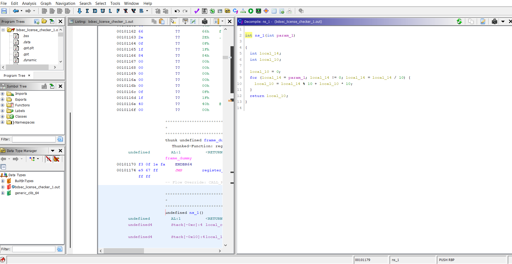
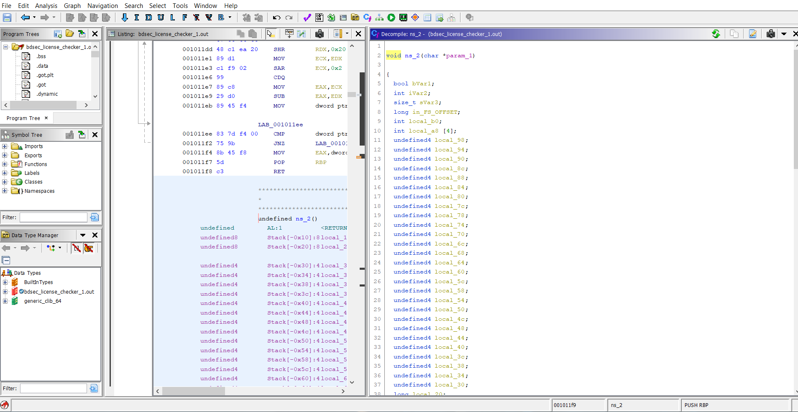
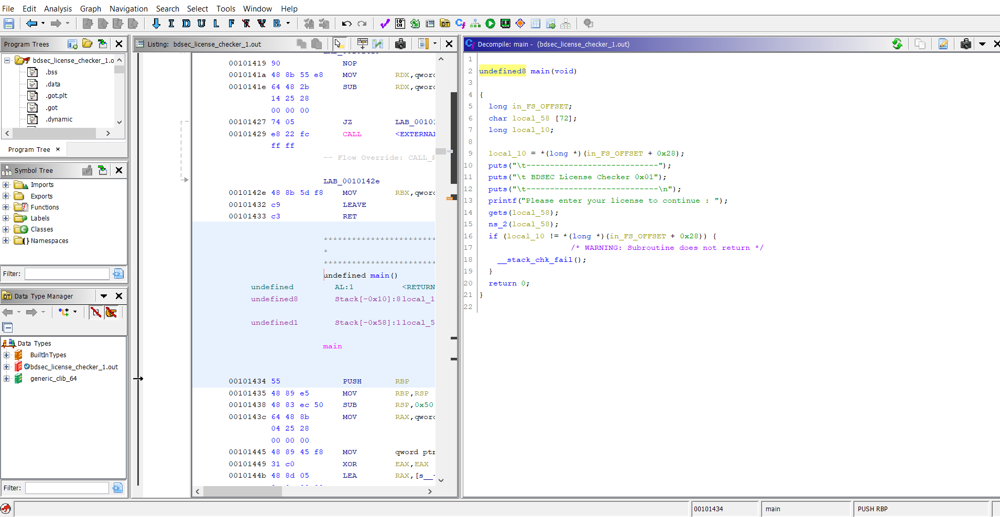
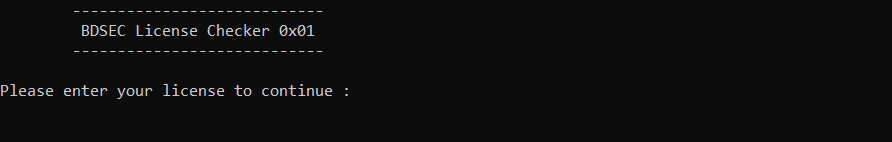
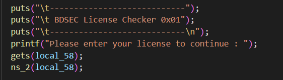
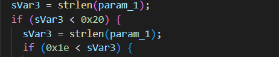
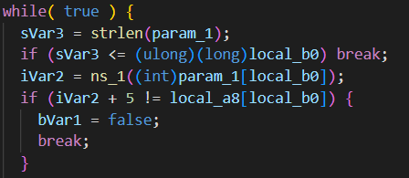
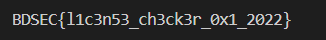
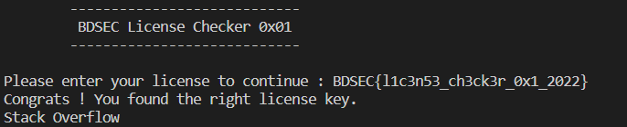

>***Can you find the correct license for me ?***

We are given a .OUT file in this problem. We need to analyze it's source code to figure out the flag.

We open the .OUT file with [Ghidra](https://ghidra-sre.org/). The decompiler shows us some useful functions in the source code:

We try to recreate the source code using these functions. We put the raw source code in **"raw_source.cpp"** file. We can see that we can build and run the file and then it asks to enter the license to continue.  

Let's analyze the code to figure out the license.

In the main() function we can see that the program takes an input string and pass it to ns2() function. 

In the ns_2() function we can see that a lot of local variables are declared and assigned to different values. Also we can see that the license strings length should be 31.

Then our input string is passed to ns_1() function and the return value is compared with the local variables.  

  

So, we can come to this conclusion that if we reverse the ns_1 function and pass the local variables through it, we might get something we can work with. We do this in **"flag_decoder.py"** file. We can see that ns_1() function is number reversing function. We handle some corner cases that might appear reversing numbers and converting them to corresponding ASCII characters. After running the file, we get the following output:

Now this out seems like the flag. We can check it by putting it as input in the source file. But the source file has some problems in the ns_2() function. Here buffer overflow is used but the memory locations aren't accessed correctly. So, we patch the source file and run it again. The code is given in **"patched_source.cpp"** file. Now we run the file and give the output string we got from **"flag_decoder.py"** file as input. The output is:

So, we can see that the decoded flag is the correct one indeed.

>>>**The flag is BDSEC{l1c3n53_ch3ck3r_0x1_2022}**
