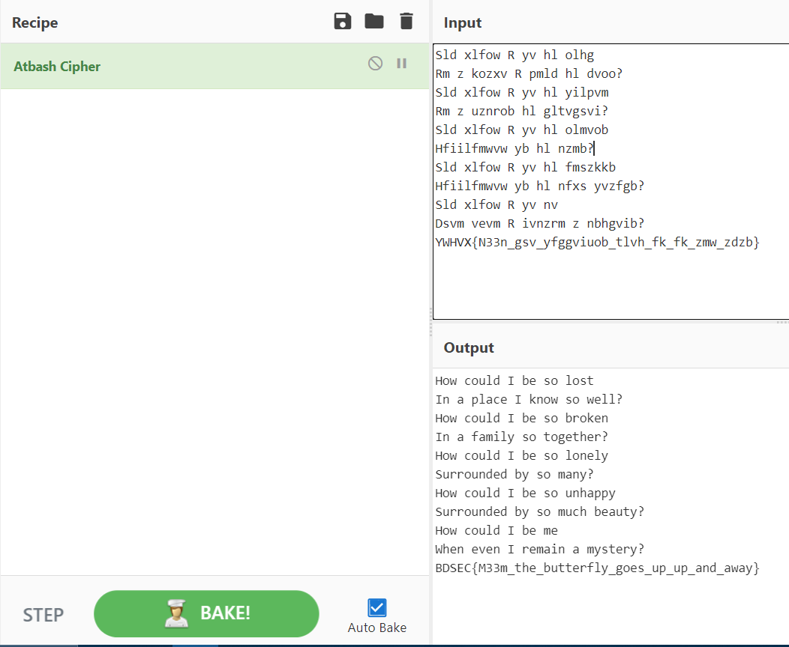

>***I'm stuck in the Dark.***

In this problem a GIF file is given and from the problem statement we can infer that the GIF file has some hidden message inside it.

We will use **Stegoveritas** to analyze this file. The steps are shown below:

It might take some time to analyze thw whole thing. After finishing we would see something like this.

If we look carefully, we will see a RAR file was found and by extracting it the tool found a file named **"cry100"**.

We can find the file in the **"results/keepers/"** directory. Opening the file we can see:

It looks like an encrypted message where the last line seems like the flag; but encrypted. We will use **Atbash Cipher** to decrypt the message. We used [CyberChef](https://gchq.github.io/CyberChef/) website for this. The output looks like:

We can see it's a poem and hurrayyy!! We got our flag!!

>>>The flag is **BDSEC{M33m_the_butterfly_goes_up_up_and_away}**

