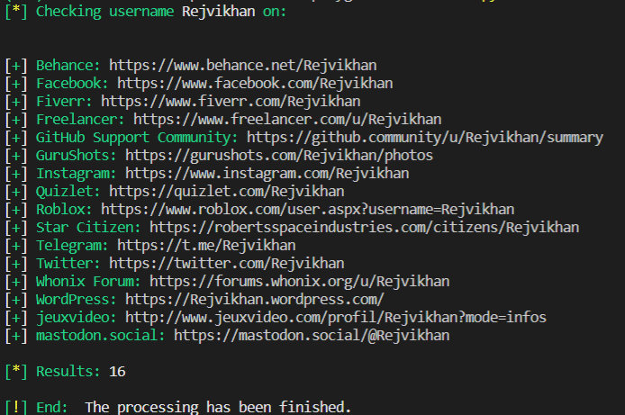

>***I just met a girl named Rejvi Khan. She told me to find her in social media. I searched on Facebook but didn't find her. I think she is using any other social media. Can you find her ?***
>
>***Flag format : BDSEC{s0mething_here}***

In this problem, we need to find a social media account named Rejvi Khan. Manually searching all the platforms is a lot of work, even some platforms are little known. We'll use a really convenient tool named [sherlock-project](https://github.com/sherlock-project/sherlock) to find her.

After installing and configuring sherlock-project, we can use the following command to find her:

    python .\sherlock\sherlock.py Rejvikhan

This results in the following output:

When we go to the last url of the list, we see the following page:

It looks like we found the account because it has posts related to **BDSEC CTF 2022**. We still need to find the flag. We can see something liek a QR code in the last post made by this account. We use google lens to scan the QR code and get the following output:

We can see a link there. We can click on it and see the following page:

And yes, we found the flag.

>>>**The flag is BDSEC{yoU_goT_m3__oS1nT_I5_fUn_r1Gh7}**
