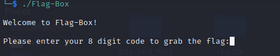
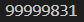
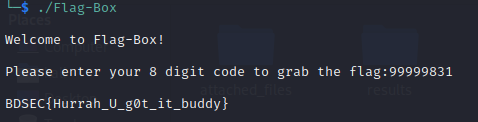

>***Find the flag from the following.***

We are given an executable file. Let's run it.

We need to find the 8 digit code. Let's open it in [Ghidra](https://ghidra-sre.org/). We can see some useful functions in the source code:

We can see in the **ox()** function, it prints the flag when called. We can manually recreate the flag from there but let's see what the main function does. We can see that it calls the **ox()** function when the two variables are equal. They were initialized with different values. If we examine the loops to check how they are supposed to become equal, we can see that this program takes a 8 digit input, multiplies all of them together and compare with a number. If they are equal, it calls the **ox()** function. So, we can backtrack the idea and factorize the number to get the 8 digit input. Let's write a python script to do that. We provide the code in **"factorizer.py"** file. When we run it, we get the following output:

Now we can input the 8 digit code to the program and get the flag. In fact any of the permutations of the 8 digit code will work.

>>>**The flag is: BDSEC{Hurrah_U_g0t_it_buddy}**
