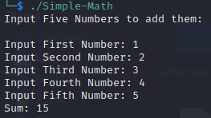
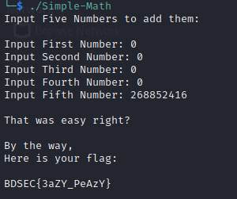

>***Can you get the flag from the following?***

We are given an executable file. Let's run it.

We can see that it's a simple program that sums 5 numbers and prints the result. Let's open it in [Ghidra](https://ghidra-sre.org/). We can see some useful functions in the source code.

In the **main()** function, we can see that it takes 5 inputs and pass them through a function named **comp()**.

In the comp() function, we can see that it sums the 5 inputs and then compares the result with **0x10065cc0** or **268852416**. If the result is equal to **0x10065cc0**, it will call a function named **fg()**. Otherwise it will print the sum of the 5 inputs.

In the fg() function, we can see that it simply prints the flag. Since the flag is given in the function as seperate characters, we can join them manually to get the flag. Also we can give 5 inputs that sum up to **268852416** to get the flag.

>>>The flag is **BDSEC{3aZY_PeAzY}**
