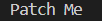
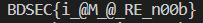

>***Patch me if you can!!***

We are given an executable file. We need to analyze it's source code to figure out the flag.

We open the file with [Ghidra](https://ghidra-sre.org/). The decompiler shows us some functions in the source code:

We try to recreate the source code using these functions. We put the raw source code in **"raw_source.cpp"** file. We can see that we can build and run the file and then it gives the following output:

So we need to patch the source code to get the flag. If we examine the code carefully, we can see that most of the functions are unnecessary. We can remove them and call only one function named **rrqqq()** to get the flag. The function have some problems in its code. We fix those and put all the necessary code in **"patched_source.cpp"** file. We can see that we can build and run the file and then it gives the following output:

And we get the flag.
>>>**The flag is BDSEC{i_@M_@_RE_n00b}**
